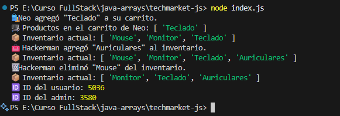
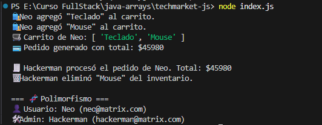
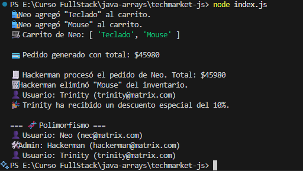

<h1 align="center">🏬 Tienda Virtual - Proyecto Grupal (POO en JS)</h1>

<div align="center">

<table>
<tr>
<td>

## 👥 Equipo Q-ERO v3 Protocol

- Agustín Valenzuela
- Karim Valenzuela  
- Javier Valenzuela   
- Anita Morales  
- Vicente Diaz
- Nicolás Peña 


</td>
<td align="center" valign="middle" width="320">
  
</td>
</tr>
</table>

</div>

Este proyecto representa una **tienda virtual** desarrollada utilizando **Programación Orientada a Objetos (POO)** en JavaScript.  
Se modelan usuarios, administradores, productos y pedidos aplicando conceptos como:

- **Clases y Constructores**
- **Herencia (`extends` + `super()`)**
- **Encapsulación (propiedades privadas `#`)**
- **Polimorfismo (métodos compartidos ejecutados de forma distinta)**
- **Modularización del código (carpetas `models` y `data`)**

## 📦 Estructura del Proyecto
```
POO-TIENDA-VIRTUAL-GRUPAL/
│ index.js
│ README.md
├─ images/
│ ├─ logo_Q-ERO.png
│ ├─ ejemplo_de_salida.png
│ ├─ ejemplo_de_salida2.png
│ └─ ejemplo_de_salida2opcional.png
└─ src/
  ├─ data/
  │ └─ inventario.js
  └─ models/
    ├─ Usuario.js
    ├─ Admin.js
    ├─ ClienteVIP.js # (Extra opcional)
    ├─ Producto.js
    └─ Pedido.js
```

## 🧱 Clases implementadas

| Clase | Rol | Descripción |
|------|-----|-------------|
| **Usuario** | Cliente general | Posee carrito y puede realizar compras. Cuenta con un `#id` privado. |
| **Admin** | Administrador de la tienda | Gestiona inventario y procesa pedidos. Hereda de Usuario. |
| **Producto** | Artículo vendible | Incluye nombre, precio y stock. |
| **Pedido** | Registro de compra | Calcula automáticamente el total del pedido. |
| **ClienteVIP** *(opcional)* | Usuario con beneficio adicional | Incluye el método `aplicarDescuento()`. |

## ▶️ Ejecución del Programa

Ejecutar desde la terminal en la carpeta del proyecto:

```bash
node index.js
```

## 🖼️ Ejemplos de Salida (Demostraciones)

### 🟣 Ejemplo Base (Usuario compra y Admin gestiona inventario)


### 🟢 Flujo de Pedido Generado y Procesado


### 👑 Extra Opcional: Cliente VIP aplicando descuento + Polimorfismo
